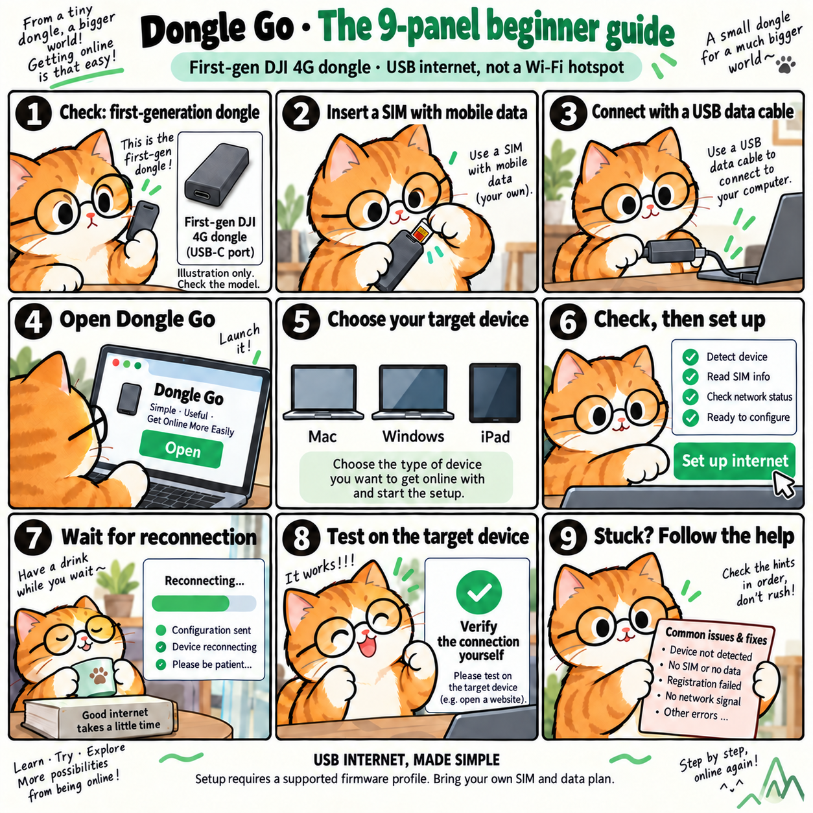

# Dongle Go

[简体中文](README.zh-CN.md) · English

**Make a supported DJI first-generation 4G dongle easier to use as a USB internet adapter.**

Dongle Go aims to replace terminal commands with a guided setup: connect your dongle, check compatibility, and configure USB internet access. This is **not Wi-Fi broadcasting**: the dongle stays connected to the device by USB.

> **Development preview — not a hardware-validated release.** No supported hardware/OS combination has passed the physical-device acceptance matrix yet. Do not buy a dongle based on this project’s compatibility claims. A mature MVP requires three independent engineering reviews, each scoring at least 95/100, plus the physical-device checks in [acceptance criteria](docs/acceptance.md).



## Download a runnable preview

[Mac / Windows downloads and opening steps](docs/downloads.md) — no Python installation required. GitHub sign-in is needed for these temporary CI artifacts. Real configuration is still locked.

Software reviews: **97 / 96 / 96**. [Evidence](docs/verification.md) includes Windows/macOS packaged-app execution and Linux tests. Hardware acceptance is separate and still pending.

## What you need

- A DJI **first-generation** 4G dongle with a compatible Quectel EG25-G module. Similar-looking and second-generation devices are not automatically supported.
- An active physical SIM card and a mobile data plan.
- A USB cable that transfers **data**, not just power.
- A Windows PC or Mac for setup. Actual device compatibility remains unverified.

## Choose where you want to get online

| Device that will use mobile data | Where setup happens | Current status |
| --- | --- | --- |
| Mac | On that Mac | Implementation target; physical-device validation pending |
| Windows PC | On that PC | Implementation target; driver and physical-device validation pending |
| USB-C iPad | First on a Windows PC or Mac, then move the dongle to iPad | Experimental; requires separate iPadOS, power and reconnection tests |
| Lightning iPad, Android, Linux, router | No supported workflow yet | Outside the initial acceptance scope |

An iPad is a **destination device**, not a supported setup computer. A successful Mac setup does not prove that the same dongle will work on an iPad. Dongle Go does not turn a Wi-Fi iPad into a model with built-in cellular hardware.

## Run the development preview

There is no hardware-approved beginner installer yet. Source setup recommends Python 3.12 with Tkinter (the pinned USB binary package has CPython 3.11–3.13 wheels, but no 3.14 wheel); this is a developer preview, not the final two-click experience. In the project directory, create an environment with `python3 -m venv .venv` on macOS, or `py -3.12 -m venv .venv` on Windows.

Activate the environment on macOS with `source .venv/bin/activate`, or on Windows PowerShell with `.venv\Scripts\Activate.ps1`. Then run:

```sh
python -m pip install -e .
python -m dongle_go --demo
```

The demo uses simulated hardware and does not configure a physical dongle. For real device diagnostics, run `python -m dongle_go` without `--demo`. **The verified firmware allowlist is currently empty, so real configuration remains blocked.** Real diagnostics query the selected serial interface or the narrowly matched factory USB interface (`2ca3:4006`). The factory USB path is read-only: it cannot configure or reboot a module. Its presence in the app is not physical-device validation; use only your intended module. On Windows, a usable existing USB driver is required; the app does not install or replace drivers.

The interface offers **Check connection**, **Set up internet** and **Restore settings**, with Mac, Windows and iPad destination choices. Selecting a destination does not certify compatibility. Packaged macOS/Windows builds require target-OS and hardware validation before release.

Hardware acceptance is scheduled for when a physical dongle is available. Until then, this preview is for interface exploration, automated verification and bounded diagnostics only.

## Start here

- [Beginner guide](docs/getting-started.md): understand the steps and the difference between a preview and real setup.
- [Troubleshooting](docs/troubleshooting.md): what to do when detection, SIM access or internet access fails.
- [Release acceptance](docs/acceptance.md): review rules and the real-hardware test matrix.

The intended primary action is **Set up internet**, not “flash firmware.” Configuration can change the dongle’s USB interface mode and make it disconnect briefly. Firmware replacement, IMEI changes, carrier bypasses, and DJI built-in eSIM unlocking are outside this project’s scope.

## Privacy and expectations

A SIM plan, usable signal and sufficient power are still required. Local software cannot activate a SIM subscription or create coverage. Real connectivity checks may use your mobile data. Never share SIM identifiers, phone numbers, SMS content, credentials or unredacted diagnostic output in public issues.

## Technical background

The compatibility investigation starts from the [community USB configuration project](https://github.com/wlzh/dji-4g-vohive-mac), [DJOneHub](https://github.com/ZenGeekLabs/DJOneHub), and [4G Connect](https://github.com/WongLoki/4G-Connect). These are independent projects, not endorsements or proof that Dongle Go works. This project is not affiliated with DJI or Quectel.
